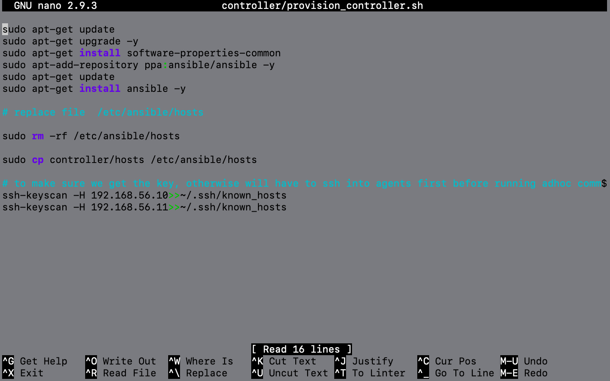
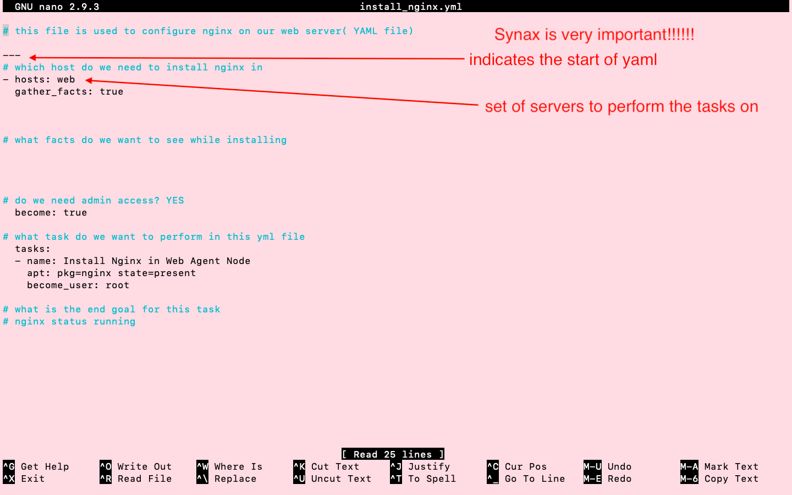
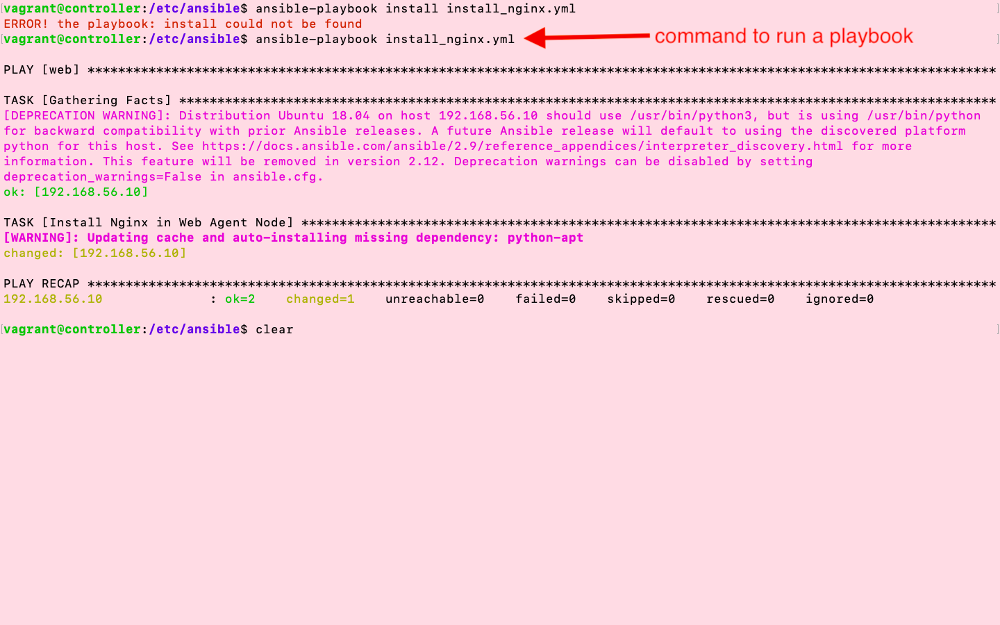
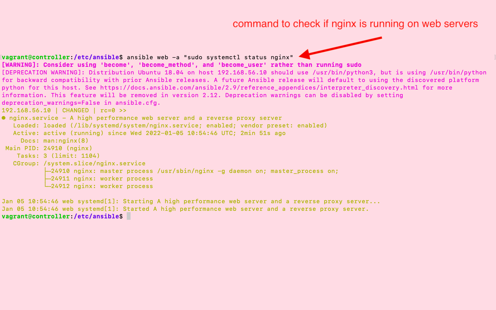

# Infrastructure as Code (IaC)
## Diagram:


## Vagrant File

```
# -*- mode: ruby -*-
 # vi: set ft=ruby :
 
 # All Vagrant configuration is done below. The "2" in Vagrant.configure
 # configures the configuration version (we support older styles for
 # backwards compatibility). Please don't change it unless you know what
 
 # MULTI SERVER/VMs environment 
 #
 Vagrant.configure("2") do |config|
    # creating are Ansible controller
      config.vm.define "controller" do |controller|
        
       controller.vm.box = "bento/ubuntu-18.04"
       
       controller.vm.hostname = 'controller'
       
       controller.vm.network :private_network, ip: "192.168.56.12"
  	controller.vm.synced_folder "./sendin", "/home/vagrant/controller"     

       # config.hostsupdater.aliases = ["development.controller"] 
       
      end 
    # creating first VM called web  
      config.vm.define "web" do |web|
        
        web.vm.box = "bento/ubuntu-18.04"
       # downloading ubuntu 18.04 image
    
        web.vm.hostname = 'web'
        # assigning host name to the VM
        
        web.vm.network :private_network, ip: "192.168.56.10"
        #   assigning private IP
        
        #config.hostsupdater.aliases = ["development.web"]
        # creating a link called development.web so we can access web page with this link instread of an IP   
            
      end
      
    # creating second VM called db
      config.vm.define "db" do |db|
        
        db.vm.box = "bento/ubuntu-18.04"
        
        db.vm.hostname = 'db'
        
        db.vm.network :private_network, ip: "192.168.56.11"
        
        #config.hostsupdater.aliases = ["development.db"]     
      end
    
    
    end

```

## provisioning File for the Controller VM

```
sudo apt-get update
sudo apt-get upgrade -y
sudo apt-get install software-properties-common
sudo apt-add-repository ppa:ansible/ansible -y
sudo apt-get update
sudo apt-get install ansible -y

# replace file  /etc/ansible/hosts

sudo rm -rf /etc/ansible/hosts

sudo cp controller/hosts /etc/ansible/hosts

# to make sure we get the key, otherwise will have to ssh into agents first before running adhoc commands
ssh-keyscan -H 192.168.56.10>>~/.ssh/known_hosts
ssh-keyscan -H 192.168.56.11>>~/.ssh/known_hosts

```

## content of /etc/ansible/hosts file
```
# comment

[web]
192.168.56.10 ansible_connection=ssh ansible_ssh_user=vagrant ansible_ssh_pass=vagrant

[db]
192.168.56.11 ansible_connection=ssh ansible_ssh_user=vagrant ansible_ssh_pass=vagrant
```

# # Launch VM using Vagrant
### Step 1: navigate the where the vagrant file is stored on local host(cd command)
- make sure vagrant file has correct IP's

### Step 2: run command "vagrant up"
- this will create 3 VM's:
    1. Controller
    2. Web
    3. DB

### Step 3: Update and Upgrade all the VM's
- Run commands:
    ```
    1. sudo apt-get update
    2. sudo apt-get upgrade -y
    ```

### Step 4: Now we can ssh into the controller, web, Db using the commands
    
    1. vagrant ssh controller
    2. vagrant ssh web
    3. vagrant ssh db

### Step 5: Setting up the Controller VM with Ansible
- we have included in the vagrant file the command to sync a folder from local host to VM:
    - controller.vm.synced_folder "./sendin", "/home/vagrant/controller"
- this synced folder contain the provisioing script and the new hosts file
- Run the provision script (give chmod permission)
    
- edit the /etc/ansible/hosts file
    
- ssh into the db and app and exit(not required if we got the key in provision script)
    1. DB:  "ssh vagrant@192.168.56.11" 
    1. web:  "ssh vagrant@192.168.56.10"

- now we can run Adhoc commands on the web and Db VM's from our controller VM

## Adhoc Commands: we run them from controller VM ; it responds with information from the agent
- control agent nodes from controller
- Ad-hoc commands are one of the simplest ways of using Ansible. These are used when you want to issue some commands on a server or bunch of servers. The ad-hoc commands are not stored for future use, but it represents a fast way to interact with the desired servers.

- To put simply, Ansible ad hoc commands are one-liner Linux shell commands and playbooks are like a shell script, a collective of many commands with logic. Ansible ad hoc commands come handy when you want to perform a quick task
## Some Adhoc commands used:
- ansible all -m ping
- ansible web -m ping
- ansible db -m ping
- ansible web -a "uname -a"
- ansible db -a "uname -a"
- ansible all -a "uname -a"
- ansible db -a "ls -a"
    - this shows the directory structure of the db
    

# Reference notes Day 1


# Play Books:
- An Ansible playbook is an organized unit of scripts that defines work for a server configuration managed by the automation tool Ansible. Ansible is a configuration management tool that automates the configuration of multiple servers by the use of Ansible playbooks.
- Ansible playbooks are executed on a set, group, or classification of hosts, which together make up an Ansible inventory
- playbook file (.yml file)
  - create a file install_nginx.yml file
    -     sudo nano install_nginx.yml

- Run the playbook
  -     ansible-playbook install_nginx.yml --syntax-check

- check from controller if nginx in running on web



# task 1
- create a playbook to install node in web
- copy app folder
- npm install and then start
- document these steps
## manually ssh inot web and run the app
Step 1: copy app folder into web using vagrant file
  
- vagarant reload web

Step 2: Write the new yaml file (setup_app.yml)
- ssh into contoller
- navigate to /etc/ansible
- create a provision.sh to set up web app
  
  
- create a file setup_app.yml
  -     sudo nano setup_app.js
  

- Run the file(setup_app.yml) from controller
- ssh into web server to start the app(npm install, npm start)


